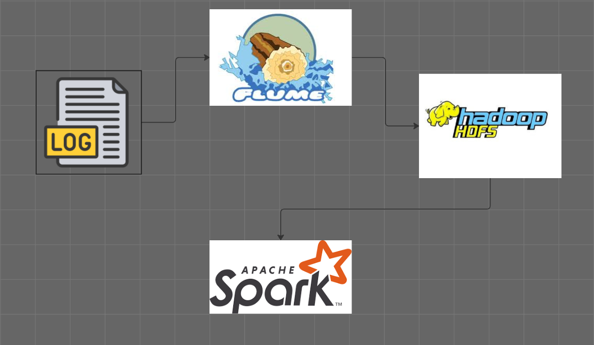

<h1 align="center">NTI-GRADUATION-PROJECT</h1>

<p align="center">
  
  
  
</p>

---

## Project Description

- The goal of this project is to use a `Log Generato`r to produce `log data`, read the logs through `Flume`, store them in `HDFS` using a configuration file, then process and organize the data using `PySpark`, and finally save the cleaned data into `external files`.

<p align="center">
  
</p>

## Overview

NTI-Graduation-Project is a comprehensive developer toolkit designed to facilitate scalable log data
ingestion, processing, and analysis within a big data ecosystem. It integrates real-time log streaming, data
validation, and analysis workflows to support monitoring, troubleshooting, and insights generation.

## Why NTI-Graduation-Project?

### This project streamlines the creation of robust data pipelines. The core features include

- Real-time Log Ingestion: Uses Flume to capture and stream logs directly into HDFS for persistent
storage.
- Log Parsing & Analysis: Leverages PySpark for extracting structured data, identifying key patterns,
    and exporting insights.
- Synthetic Log Generation: Produces customizable, timestamped logs for testing and simulation.
- Data Validation: Ensures data integrity with checksum files, maintaining reliable workflows.
- Setup & Monitoring: Provides comprehensive Linux command guides for seamless setup and
    system monitoring.

### Steps to Follow

- You will find all the commands and setup instructions in the [Linux_Commands.md](/linux_command.md) file, and the most important file to fully understand the whole process is the [presentation.pdf](/presentation.pdf).

**Main files to check:**

- `logGenerator/log_generator.py` → for log generation.
- `flumeHdfs.conf` → for Flume configuration.
- `notebook.ipynb` → for data processing and analysis using PySpark.
- `presentation.pdf` → to understand the full project flow visually.

## Getting Started

**Clone the repository:**

```bash
git clone https://github.com/khattabx/NTI-Graduation-Project
